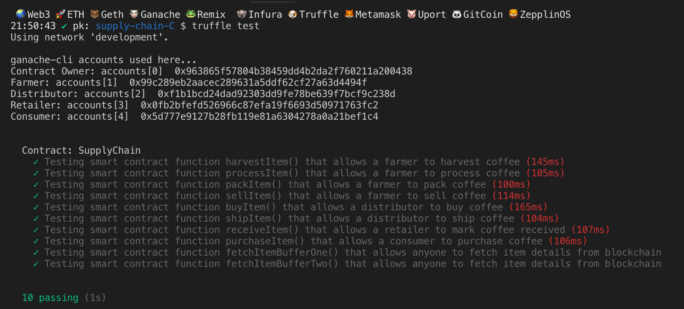

# Coffee Supply chain & data auditing

This repository containts an Ethereum DApp that demonstrates a Supply Chain flow between a Seller and Buyer. The user story is similar to any commonly used supply chain process. A Seller can add items to the inventory system stored in the blockchain. A Buyer can purchase such items from the inventory system. Additionally a Seller can mark an item as Shipped, and similarly a Buyer can mark an item as Received.

The 4 actors in the coffee supply chain are:

- Farmer: The Farmer can harvest coffee beans, process coffee beans, pack coffee palettes, add coffee palettes, ship coffee palettes, and track authenticity.
- Distributor: The Distributor can buy coffee palettes and track authenticity.
- Retailer: The Retailer can receive coffee palettes and track authenticity.
- Consumer: The consumer can buy coffee palettes and track authenticity.


The DApp User Interface when running should look like...


### Contract Creation Addresses on the Rinkeby Network:
- 0xEe3a199Bc38CEb4ABF366dBFCC939291FF350Da8
- 0x4715BaD018d166379d1De3D45028Fb0B70D2dE72
- 0xdCf71Ab205cf68Dd712EBB1A09cf3863Bf41BF23
- 0x0eDF3B99bbbEFAcc28270747B0835A50B435976c
- 0x0eDF3B99bbbEFAcc28270747B0835A50B435976c


## UML Diagrams

### Activity Diagram


### Sequence Diagram


### State Diagram


### Data Model


## Getting Started

These instructions will get you a copy of the project up and running on your local machine for development and testing purposes. See deployment for notes on how to deploy the project on a live system.

### Prerequisites

Please make sure you've already installed ganache-cli, Truffle and enabled MetaMask extension in your browser.

Truffle v5.0.21 (core: 5.0.21)

Node v10.15.3

Solidity >=0.4.24

### Installing

A step by step series of examples that tell you have to get a development env running

Clone this repository:

```
git clone https://github.com/sdossou/Project-6b-Coffee_Supply_Chain
```

Change directory to ```project-6``` folder and install all requisite npm packages (as listed in ```package.json```):

```
cd project-6
npm install
```

Launch Ganache:

```
ganache-cli -m "spirit supply whale amount human item harsh scare congress discover talent hamster"
```

Your terminal should look something like this:


In a separate terminal window, Compile smart contracts:

```
truffle compile
```

Your terminal should look something like this:


This will create the smart contract artifacts in folder ```build\contracts```.

Migrate smart contracts to the locally running blockchain, ganache-cli:

```
truffle migrate
```

Your terminal should look something like this:


Test smart contracts:

```
truffle test
```

All 10 tests should pass.



In a separate terminal window, launch the DApp:

```
npm run dev
```

## Built With

* [Ethereum](https://www.ethereum.org/) - Ethereum is a decentralized platform that runs smart contracts
* [IPFS](https://ipfs.io/) - IPFS is the Distributed Web | A peer-to-peer hypermedia protocol
to make the web faster, safer, and more open.
* [Truffle Framework](http://truffleframework.com/) - Truffle is the most popular development framework for Ethereum with a mission to make your life a whole lot easier.


## Authors

See also the list of [contributors](https://github.com/your/project/contributors.md) who participated in this project.

## Acknowledgments

* Solidity
* Ganache-cli
* Truffle
* IPFS
* Infuria
* Metamask
